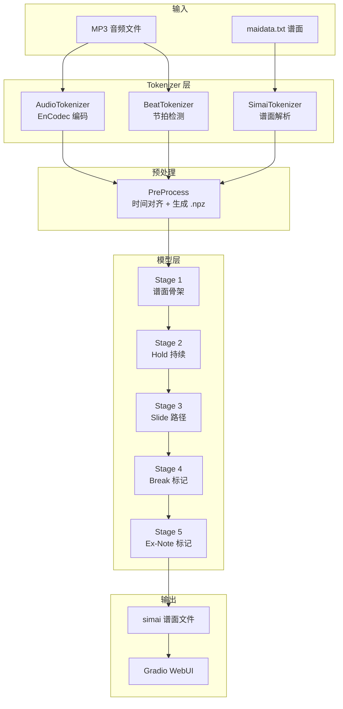

# 🎹 maiChartGen3 — AI 谱面生成器

基于多阶段 Transformer 的 **maimai 节奏游戏谱面自动生成系统**。输入一首 MP3 音频，AI 自动生成完整可玩的 simai 格式谱面。

---

## 📋 目录

- [项目概览](#项目概览)
- [系统架构](#系统架构)
- [数据流全景](#数据流全景)
- [1. Tokenizer 层](#1-tokenizer-层)
  - [1.1 SimaiToken — 谱面 Token 化](#11-simaitoken--谱面-token-化)
  - [1.2 AudioTokenizer — 音频编码 (EnCodec)](#12-audiotokenizer--音频编码-encodec)
  - [1.3 BeatTokenizer — 节拍检测](#13-beattokenizer--节拍检测)
- [2. 预处理管线 (PreProcess)](#2-预处理管线-preprocess)
- [3. 模型架构](#3-模型架构)
  - [3.1 共享组件 (`models/common.py`)](#31-共享组件-modelscommonpy)
  - [3.2 Stage 1 — 谱面骨架生成](#32-stage-1--谱面骨架生成)
  - [3.3 Stage 2 — Hold 持续时间预测](#33-stage-2--hold-持续时间预测)
  - [3.4 Stage 3 — Slide 路径补全](#34-stage-3--slide-路径补全)
  - [3.5 Stage 4 — Break 标记预测](#35-stage-4--break-标记预测)
  - [3.6 Stage 5 — Ex-Note 标记预测](#36-stage-5--ex-note-标记预测)
- [4. 训练流程](#4-训练流程)
  - [4.1 分阶段训练](#41-分阶段训练)
  - [4.2 无限循环训练 (`train_loop.py`)](#42-无限循环训练-train_looppy)
  - [4.3 Stage 3 重训 (`retrain_stage3.py`)](#43-stage-3-重训-retrain_stage3py)
- [5. 推理流程](#5-推理流程)
  - [5.1 完整 5-Stage 推理 (`infer_full.py`)](#51-完整-5-stage-推理-infer_fullpy)
  - [5.2 3-Stage 推理 (`infer_3stage_master13.py`)](#52-3-stage-推理-infer_3stage_master13py)
- [6. WebUI (`webui.py`)](#6-webui-webuipy)
- [7. 配置系统](#7-配置系统)
- [8. 项目结构](#8-项目结构)
- [9. 快速开始](#9-快速开始)
- [10. 关键设计决策](#10-关键设计决策)

---

## 项目概览

maiChartGen3 是一个基于深度学习的 maimai 谱面自动生成系统。它使用 **EnCodec 神经音频编解码器** 将音频压缩为离散 token，通过 **多阶段 Transformer 模型** 逐级生成谱面的各个属性（音符类型 → Hold 持续 → Slide 路径 → Break/Ex 标记），最终输出标准 simai 格式谱面。

### 核心特性

| 特性 | 说明 |
|------|------|
| 🎵 音频驱动 | 使用 Meta EnCodec (24kHz) 编码音频为离散 token |
| 🏗️ 多阶段生成 | 5 个 Stage 级联，从骨架到细节逐级细化 |
| 🏷️ 条件控制 | 支持难度、等级、曲库标签等多维条件控制 |
| 📐 AHPE 位置编码 | 自研累积 Householder 位置编码，比正弦 PE 更丰富 |
| 🎛️ 灵活采样 | Temperature / Top-K / 密度偏置 / 音符类型偏置 |
| 🖥️ WebUI | Gradio 可视化界面，一键生成 + 参数调节 |
| 🔄 无限训练循环 | 自动预处理 → 分层验证 → 循环训练 → 保存最优 |

---

## 系统架构



---

## 数据流全景

```
maidata.txt                         MP3 音频
     │                                  │
     ▼                                  ├──────────────┐
SimaiPaser.parse()                      ▼              ▼
     │                          AudioTokenizer    BeatTokenizer
     ▼                          (EnCodec 75Hz)   (librosa)
SimaiChart.tokens                       │              │
     │                                  ▼              ▼
     │                          audio_tokens     beat_list
     │                          (T, 8) int32    (时间戳)
     │                                  │              │
     └──────────┬───────────────────────┴──────────────┘
                ▼
         Preprocess._align_v2()
                │
                ▼
         .npz + .json 文件
    (audio_tokens, beat_signal, chart_tokens,
     break_mask, ex_mask, firework_mask,
     hold_dur_targets, slide_path_targets, tag_ids)
                │
                ▼
         5-Stage Training / Inference
                │
                ▼
          simai 谱面输出
```

---

## 1. Tokenizer 层

### 1.1 SimaiToken — 谱面 Token 化

**文件**: `SimaiToken.py`

将 maimai simai 格式的谱面文本解析为结构化 token 序列。

#### Token 类型

| Token 类型 | 示例 | 说明 |
|-----------|------|------|
| `tap` | `tap1`, `tap12`, `tap1{b}` | Tap / 双押 (多位置合并) |
| `hold` | `hold1{dur:4:1}`, `holdB1{dur:8:1}` | Hold 长按 (含触摸 Hold) |
| `slide` | `slide1{path:>-4,dur:8:1}` | Slide 滑条 (含路径和时序) |
| `touch` | `touchB1`, `touchB3B4{firework}` | Touch 触摸 |
| `rest` | `rest` | 休止符 |
| `bpm` | `bpm160.0` | BPM 变更 |
| `measure` | `measure4` | 小节标记 (subdiv) |

#### 核心类

```python
@dataclass
class SimaiToken:
    token_type: SimaiTokenType  # TAP/HOLD/SLIDE/TOUCH/REST/BPM/MEASURE
    position: str               # 位置 (e.g., "1", "12", "B1", "C")
    params: dict                # 参数 {break, ex, firework, dur, path}
    measure: int                # 小节序号
    beat: float                 # 拍内位置 (归一化 0~1)
    subdiv: int                 # 当前 BPM 拍分割数
```

#### 关键功能

- **Each 合并**: `1/2` → `tap12` (双押合并为一个 token)
- **Touch 合并**: `B3/B4` → `touchB3B4` (同帧多触摸合并)
- **Slide 解析**: 支持复杂路径 `1>5-8[4:1]`、`4>8[8:1]*V28[8:1]` 等
- **Break/Ex/Firework 标记**: 通过 `params` 字典传递
- **Subdiv 缩放**: `rescale_subdiv()` 将不同 subdiv 统一为目标值
- **双向转换**: `to_string()` / `from_string()` 序列化/反序列化
- **Simai 导出**: `tokens_to_simai()` 将 token 列表导出为标准 simai 格式

---

### 1.2 AudioTokenizer — 音频编码 (EnCodec)

**文件**: `AudioTokenizer.py`

使用 Meta 的 **EnCodec** 神经音频编解码器将音频波形压缩为多层离散 token。

#### 技术参数

| 参数 | 值 |
|------|-----|
| 模型 | `facebook/encodec_24khz` |
| 原生采样率 | 24,000 Hz |
| 帧率 | 75 Hz (每帧约 13.3ms) |
| Codebook 数量 | 2/4/8/16/32 (对应 1.5~24.0 kbps) |
| Token 值域 | 0~1023 (每个 codebook) |
| 推荐配置 | 8 codebooks (高保真) / 4 codebooks (平衡) |

#### 核心类

```python
@dataclass
class AudioTokenData:
    tokens: np.ndarray          # (num_frames, num_codebooks) int32
    sample_rate: int            # 原始采样率
    frame_rate: float           # 75.0 Hz
    duration: float             # 音频时长 (秒)
    num_codebooks: int          # codebook 数量
```

#### 关键功能

- **自动重采样**: 任意采样率音频 → 24kHz
- **多声道 → 单声道**: 自动混合为 mono
- **延迟加载**: 首次使用时才加载 EnCodec 模型
- **本地优先**: 支持从 `premodels/` 目录加载本地模型
- **编码/解码**: `encode()` / `decode()` / `encode_file()`

---

### 1.3 BeatTokenizer — 节拍检测

**文件**: `BeatTokenizer.py`

使用 **librosa** (或可选的 **beat_this** 深度学习模型) 检测音频节拍。

#### 核心类

```python
@dataclass
class BeatEvent:
    time: float           # 时间戳 (秒)
    beat_index: int       # 全局拍序号
    measure: int          # 小节序号
    beat_in_measure: int  # 小节内拍位
    is_downbeat: bool     # 是否为重拍 (每小节第一拍)
    bpm: float            # 当前 BPM

@dataclass
class BeatList:
    beats: list[BeatEvent]
    bpm: float            # 整体 BPM
    time_signature: int   # 拍号 (默认 4/4)
    duration: float       # 音频时长
```

#### 关键功能

- **双后端支持**: `librosa` (经典动态规划) / `beat_this` (深度学习)
- **BPM 纠正**: 支持 `target_bpm` 纠正半速/双倍速误检
- **节拍量化**: `quantize_beats=True` 将节拍对齐到均匀网格
- **重拍检测**: 自动识别每小节第一拍 (downbeat)

---

## 2. 预处理管线 (PreProcess)

**文件**: `PreProcess.py`

将所有数据对齐到统一的 **75Hz 帧率网格**，生成 `.npz` + `.json` 文件对。

### 处理流程

```
maidata.txt ──→ SimaiPaser.parse() ──→ SimaiChart (含所有难度)
MP3 音频    ──→ AudioTokenizer ──────→ AudioTokenData (共享)
MP3 音频    ──→ BeatTokenizer  ──────→ BeatList (共享)
                                            │
                    ┌───────────────────────┘
                    ▼
            Preprocessor._align_v2()
                    │
        ┌───────────┼───────────┐
        ▼           ▼           ▼
   音频对齐    节拍对齐    谱面对齐
   (帧插值)   (帧映射)   (时间→帧)
        │           │           │
        └───────────┼───────────┘
                    ▼
            PreprocessResult
                    │
                    ▼
          .npz (张量数据) + .json (元数据)
```

### 输出文件格式

**`.npz` 文件** (NumPy 压缩格式):

| 数组名 | Shape | 类型 | 说明 |
|--------|-------|------|------|
| `audio_tokens` | `(T, C)` | int32 | EnCodec 音频 token |
| `beat_signal` | `(T, 2)` | float32 | `[beat, downbeat]` 二值信号 |
| `chart_tokens` | `(T,)` | int32 | 扁平化谱面 token ID (0=空) |
| `break_mask` | `(T,)` | bool | Break 音符掩码 |
| `ex_mask` | `(T,)` | bool | Ex-note 掩码 |
| `firework_mask` | `(T,)` | bool | 烟花特效掩码 |
| `hold_dur_targets` | `(T,)` | int32 | Hold 持续时间离散桶 ID |
| `slide_path_targets` | `(T,)` | int32 | Slide 路径 segment ID |
| `tag_ids` | `(K,)` | int32 | 标签 ID 序列 |
| `frame_rate` | `(1,)` | float32 | 帧率 (75.0) |

**`.json` 文件**:

```json
{
  "chart_vocab": {"tap1": 1, "tap12": 2, "hold1{dur:4:1}": 3, ...},
  "tag_vocab": {"difficulty:Master": 0, "collection:Original": 1, ...},
  "slide_vocab": {"<PAD>": 0, "-4": 1, ">5": 2, ...},
  "frame_objects": {"123": [{"type":"tap","pos":"1"}, ...], ...},
  "metadata": {"title": "...", "artist": "...", "bpm": 160.0, ...}
}
```

### 全局文件

预处理完成后在 `preprocessed/` 目录生成:

| 文件 | 内容 |
|------|------|
| `vocab.json` | 全局谱面 token → ID 映射 |
| `tag_vocab.json` | 全局标签 → ID 映射 |
| `slide_vocab.json` | 全局 Slide 路径 segment → ID 映射 |
| `slide_path_timing_map.json` | Slide 路径 → 最佳时序映射 |

---

## 3. 模型架构

### 3.1 共享组件 (`models/common.py`)

#### StageConfig — 统一超参配置

```python
@dataclass
class StageConfig:
    d_model: int = 512           # 模型维度
    n_head: int = 8              # 注意力头数
    n_layer: int = 6             # Transformer 层数
    d_ff: int = 2048             # FFN 维度
    dropout: float = 0.1
    max_seq_len: int = 8192      # 最大序列长度
    ahpe_householder_order: int = 2  # AHPE 阶数
    audio_num_codebooks: int = 8  # 音频 codebook 数
    chart_vocab_size: int = 512   # 谱面词表大小
    hold_dur_bins: int = 64       # Hold 持续离散桶数
    slide_vocab_size: int = 256   # Slide 路径词表大小
    ...
```

#### FastAHPE — 累积 Householder 位置编码

本项目自研的位置编码方案，基于 **Householder 反射**:

$$H_u(v) = v - 2\langle u, v \rangle u$$

位置 $t$ 的编码为多个 Householder 变换的累积:

$$\text{PE}(t) = \text{scale} \cdot H_{u_t} \circ \cdots \circ H_{u_1}(\text{base})$$

相比标准正弦位置编码的优势:
- ✅ **可学习**: 反射向量可通过训练优化
- ✅ **丰富表达**: 累积变换能编码更复杂的相对位置关系
- ✅ **向量化高效**: 预计算缓存，推理时 O(1)

#### 其他共享组件

| 组件 | 功能 |
|------|------|
| `AudioEncoder` | 将 EnCodec token 嵌入为连续向量 + Conv1d + AHPE |
| `ConditionEmbedding` | 节拍/难度/等级/标签 → 条件向量 (含 Global + Dynamic 双分支标签注意力) |
| `ChartAudioFusion` | 谱面嵌入 + 位置编码 + 门控音频融合 + 条件注入 |
| `TransformerBlock` | Pre-LN Transformer + 可选 Cross-Attention + GELU |
| `build_causal_mask` | 构建因果注意力掩码 |

---

### 3.2 Stage 1 — 谱面骨架生成

**文件**: `models/stage1_chart.py` | **类**: `Stage1ChartModel`

```
输入: audio_tokens + beat_signal + difficulty + level + tags
输出: chart_tokens (每帧一个谱面 token ID)
训练: Cross-Entropy (逐帧独立预测，含 id=0 的空音符类)
推理: Temperature + Top-K 采样
```

**架构**:

```
AudioEncoder(audio)
       │                    ConditionEmbedding(beat, diff, level, tags)
       │                             │
       │                    input_proj(cond) ← 谱面 token 嵌入 (训练时)
       │                             │
       └──────────┬──────────────────┘
                  ▼
    TransformerBlock × n_layer (cross-attn → audio)
                  │
                  ▼
           LN → Linear(V)
                  │
           chart_logits (B, T, chart_vocab_size)
```

**关键设计**:
- 非自回归: 每帧独立预测，训练效率高
- Cross-attention 到音频: 每个谱面帧可关注全局音频上下文
- ID=0 作为合法的「空音符」类，确保 loss 计算覆盖所有帧

---

### 3.3 Stage 2 — Hold 持续时间预测

**文件**: `models/stage2_hold.py` | **类**: `Stage2HoldModel`

```
输入: stage1_chart + audio_tokens + beat_signal + conditions
输出: hold_dur_logits (B, T, max_hold_slots, hold_dur_bins)
训练: 因果自回归 (hold 序列内部)，仅 hold 位置计算 CE loss
推理: 自回归采样 hold 持续时间
```

**架构**:

```
stage1_chart → chart_embed ──┐
audio → AudioEncoder ────────┤
beat/diff/level/tags ───────→ ChartAudioFusion → chart_fusion
                                       │
                          Causal Transformer × n_layer
                          (cross-attn → audio)
                                       │
                          LN → slot_embed → Linear(hold_dur_bins)
                                       │
                          hold_dur_logits (B, T, S, D)
```

**持续时间离散化**: 将连续的 hold 持续时间映射到 `hold_dur_bins` (默认 64) 个离散桶:

$$\text{seconds} = 2^{\text{bin} - 5}$$

---

### 3.4 Stage 3 — Slide 路径补全

**文件**: `models/stage3_slide.py` | **类**: `Stage3SlideModel`

```
输入: stage2_chart + audio + conditions
输出: slide_path_logits (B, T, max_slide_slots, slide_vocab_size)
训练: 因果自回归 (时间维度 + slot 维度双层 causal)，仅 slide 位置计算 CE loss
推理: Temperature + Top-K 采样，含路径合法性校验
```

**Slide 路径词表构建** (`build_slide_vocab`):

```
原始路径: ">-4"  →  ["-4"]
原始路径: ">5-8" →  [">5", "-8"]
原始路径: ">8*V28" → [">8", "*V28"]
原始路径: "V35"  →  ["V35"]
```

**Slot-wise 建模**: 同一帧可有多个 slide segment，按 slot 序列做短程因果建模:

```
时间维度 causal mask (T×T) ──→ 不同帧的 slide 先后有序
Slot 维度 causal mask (S×S)  ──→ 同帧多段路径先后有序
```

**路径合法性校验**: 推理时自动过滤:
- 直线同点: `1-1[...]` 无效
- 相邻位置: `1-2[...]` 或 `1-8[...]` (环形相邻) 无效

---

### 3.5 Stage 4 — Break 标记预测

**文件**: `models/stage4_break.py` | **类**: `Stage4BreakModel`

```
输入: stage3_chart + audio + conditions
输出: break_logits (B, T, max_object_slots, 2) → [not_break, break]
训练: 二分类 Cross-Entropy (非因果，双向)，仅 note 位置计算
推理: argmax 二值预测
```

**设计**: 双向 Transformer，每个音符位置可访问前后文信息，判断该音符是否应为 Break (绝赞)。

---

### 3.6 Stage 5 — Ex-Note 标记预测

**文件**: `models/stage5_ex.py` | **类**: `Stage5ExModel`

```
输入: stage4_chart + audio + conditions
输出: ex_logits (B, T, max_object_slots, 2) → [not_ex, ex]
训练: 二分类 Cross-Entropy (非因果，双向)，仅 note 位置计算
推理: argmax 二值预测
```

**设计**: 与 Stage 4 架构相同，仅在 DX 谱面 (有 Ex-note) 上训练。

---

## 4. 训练流程

### 4.1 分阶段训练

每个 Stage 有独立的训练脚本:

| 脚本 | Stage | 任务 | 关键超参 |
|------|-------|------|---------|
| `train_stage1.py` | Stage 1 | 谱面骨架 | n_layer=6, lr=1e-4 |
| `train_all_stages.py` | Stage 2~5 | Hold/Slide/Break/Ex | n_layer=3~4, lr=3e-4 |

**Stage 1 训练** (`train_stage1.py`):

```python
# 数据加载
dataset = PreprocessedDataset(data_dir, max_frames=512)
loader = DataLoader(dataset, batch_size=2, collate_fn=collate_fn)

# 训练循环
for audio, beat, chart, diff, lvl, tags in loader:
    output = model(audio, beat, diff, lvl, tags, chart_tokens=chart)
    loss = output["loss"]  # Cross-Entropy on all frames
    loss.backward()
    optimizer.step()
```

**Stage 2~5 训练** (`train_all_stages.py`):

- Stage 2: 从原始 `maidata.txt` 提取 hold duration 真值
- Stage 3: 构建 slide path vocab，从 `maidata.txt` 提取路径真值
- Stage 4/5: 使用预处理数据中的 break/ex mask

### 4.2 无限循环训练 (`train_loop.py`)

**文件**: `train_loop.py`

完整的自动化训练管线:

```
1. 全量预处理 (跳过已存在)
2. 按难度分层抽取验证集 (每难度 25 个样本)
3. 循环:
   ├── Stage 1: 训练 N epochs → 验证 → 保存 best
   ├── Stage 2: 训练 N epochs → 验证 → 保存 best
   ├── Stage 3: 训练 N epochs → 验证 → 保存 best
   ├── Stage 4: 训练 N epochs → 验证 → 保存 best
   └── Stage 5: 训练 N epochs → 验证 → 保存 best
4. 无限循环直到手动停止 (Ctrl+C 优雅退出)
```

**特性**:
- 系统监控: CPU/RAM/GPU/VRAM 实时使用率
- 日志记录: 自动保存到 `logs/` 目录
- 信号处理: SIGINT/SIGTERM 优雅停止
- 配置驱动: 所有参数通过 `Config/default.yaml` 控制

### 4.3 Stage 3 重训 (`retrain_stage3.py`)

**文件**: `retrain_stage3.py`

专门用于使用含 timing 信息的新 Slide 词表 (`slide_vocab_with_timing.json`) 重新训练 Stage 3:

```bash
python retrain_stage3.py
```

参数: d_model=512, n_head=8, n_layer=6, audio_num_codebooks=8, batch_size=2×4(GA)

---

## 5. 推理流程

### 5.1 完整 5-Stage 推理 (`infer_full.py`)

**文件**: `infer_full.py`

```python
infer_full(
    mp3_path="samples/人是猫/track.mp3",
    output_path="samples/人是猫/maidata_full.txt",
    difficulty="Master",
    level=12.0,
    designer="AI",
)
```

**推理流水线**:

```
MP3 音频
   │
   ├──→ AudioTokenizer (EnCodec 8 codebooks) → audio_tokens (T, 8)
   │
   ├──→ BeatTokenizer (librosa) → beat_signal (T, 2)
   │
   ├──→ [标签构建] difficulty + level + collection tags
   │
   ▼
Stage 1: 音频+条件 → 谱面骨架 (Temperature=0.8, Top-K=50)
   │
   ▼
Stage 2: +骨架 → Hold 持续时间 (自回归采样)
   │
   ▼
Stage 3: +骨架 → Slide 路径 (自回归采样, 含路径校验)
   │
   ▼
Stage 4: +骨架 → Break 标记 (双向二分类)
   │
   ▼
Stage 5: +骨架 → Ex-Note 标记 (双向二分类)
   │
   ▼
构建 simai 输出 → maidata.txt
```

### 5.2 3-Stage 推理 (`infer_3stage_master13.py`)

**文件**: `infer_3stage_master13.py`

仅使用 Stage 1~3 (不含 Break/Ex 标记)，适用于非 DX 谱面或快速原型。

---

## 6. WebUI (`webui.py`)

**文件**: `webui.py`

基于 **Gradio** 构建的可视化界面，提供完整的参数调节和一键生成功能。

### 界面布局

```
┌──────────────────────────────────────────────────┐
│  🎹 maiChartGen3 — AI 谱面生成器                  │
├────────────────────┬─────────────────────────────┤
│  左栏: 输入参数     │  右栏: 输出结果               │
│                    │                             │
│  🎵 音频输入        │  📝 simai 谱面文本            │
│  [上传 MP3]        │  [可编辑文本框]               │
│                    │                             │
│  ⚙️ 谱面参数        │  📊 统计信息                  │
│  难度 [Master ▼]   │  总音符/Tap/Hold/Slide/      │
│  等级 [13.0 ▬]     │  Break/Ex 计数               │
│  作者 [AI_____]    │                             │
│  曲库 [Original]   │                             │
│                    │                             │
│  🎛️ 生成控制        │                             │
│  Temperature ▬     │                             │
│  Top-K ▬           │                             │
│  密度偏置 ▬        │                             │
│  Tap/Hold/Slide    │                             │
│  /Touch/Break 偏置 │                             │
│  [过滤三押] ☑      │                             │
│  [跳过 Stage...]   │                             │
│                    │                             │
│  [🚀 生成谱面]     │                             │
└────────────────────┴─────────────────────────────┘
```

### 可调节参数

| 参数 | 范围 | 说明 |
|------|------|------|
| Temperature | 0.1~2.0 | 控制采样随机性 |
| Top-K | 1~500 | 限制候选 token 数量 |
| 密度偏置 | -5~+5 | 正=更多音符, 负=更多空位 |
| Tap 偏置 | -5~+5 | Tap 偏好 |
| Hold 偏置 | -5~+5 | Hold 偏好 |
| Slide 偏置 | -5~+5 | Slide 偏好 |
| Touch 偏置 | -5~+5 | Touch 偏好 |
| TouchHold 偏置 | -5~+5 | TouchHold 偏好 |
| Break 偏置 | -5~+5 | Break 标记偏好 |
| 过滤三押 | 开关 | 自动过滤 ≥3 同时 Tap |
| 跳过 Stage | 多选 | 跳过指定 Stage 的推理 |

### 启动

```bash
python webui.py [--config server_4090]
```

---

## 7. 配置系统

**目录**: `Config/`

| 文件 | 用途 |
|------|------|
| `template.yaml` | 配置模板 (所有参数定义和说明) |
| `default.yaml` | 默认配置 (开箱即用) |
| `server_4090.yaml` | 服务器 RTX 4090 配置 |
| `__init__.py` | ConfigLoader (类型安全的配置加载器) |

### 配置结构

```yaml
paths:          # 路径配置
audio:          # 音频编码配置 (EnCodec)
chart:          # 谱面配置 (subdiv, 难度)
beat:           # 节拍检测配置
preprocess:     # 预处理配置
tags:           # 标签配置
data:           # 数据集配置
model:          # 模型配置 (主模型)
stage_model:    # Stage 模型配置
stage1~5_model: # 各 Stage 特定配置
training:       # 训练超参
train_loop:     # 循环训练配置
logging:        # 日志配置
generation:     # 生成/推理配置
```

### 类型安全访问

```python
from Config import load_config
cfg = load_config()                      # 加载默认配置
cfg = load_config("server_4090")         # 加载特定配置
print(cfg.audio.num_codebooks)           # 8
print(cfg.preprocess.output_dir)         # "preprocessed"
print(cfg.generation.temperature)        # 0.8
```

---

## 8. 项目结构

```
maiG_v2/
├── SimaiToken.py              # 谱面 Tokenizer (核心)
├── SimaiPaser.py              # maidata.txt 解析器
├── AudioTokenizer.py          # EnCodec 音频编码器
├── BeatTokenizer.py           # 节拍检测器
├── PreProcess.py              # 预处理管线
├── build_slide_vocab_with_timing.py  # Slide 词表构建
├── demo_tokenizer.py          # Tokenizer 演示脚本
│
├── models/                    # 模型定义
│   ├── common.py              #   共享组件 (Config, AHPE, AudioEncoder, Transformer)
│   ├── stage1_chart.py        #   Stage 1: 谱面骨架
│   ├── stage2_hold.py         #   Stage 2: Hold 持续时间
│   ├── stage3_slide.py        #   Stage 3: Slide 路径
│   ├── stage4_break.py        #   Stage 4: Break 标记
│   └── stage5_ex.py           #   Stage 5: Ex-Note 标记
│
├── Config/                    # 配置系统
│   ├── __init__.py            #   ConfigLoader
│   ├── template.yaml          #   配置模板
│   ├── default.yaml           #   默认配置
│   └── server_4090.yaml       #   服务器配置
│
├── train_stage1.py            # Stage 1 训练脚本
├── train_stage1_v2.py         # Stage 1 v2 训练脚本
├── train_all_stages.py        # Stage 2~5 训练脚本
├── train_loop.py              # 无限循环训练管线
├── retrain_stage3.py          # Stage 3 重训脚本
│
├── infer_full.py              # 5-Stage 完整推理
├── infer_3stage_master13.py   # 3-Stage 推理 (Master 13)
├── server_pipeline_stage3.py  # 服务器端 Stage 3 管线
│
├── webui.py                   # Gradio WebUI
├── compare_logs.py            # 日志对比工具
│
├── datasets/                  # 原始谱面数据 (maidata.txt + track.mp3)
├── preprocessed/              # 预处理输出 (.npz + .json)
├── checkpoints/               # 模型检查点
│   ├── stage1_best.pt ~ stage5_best.pt
│   └── stage1_last.pt ~ stage5_last.pt
├── premodels/                 # 预训练模型 (EnCodec, beat_this)
├── samples/                   # 测试样本
├── output/                    # 生成输出
│   └── generated.txt
├── logs/                      # 训练日志
├── collections/               # 曲库分类
├── tests/                     # 测试
└── requirements.txt           # Python 依赖
```

---

## 9. 快速开始

### 环境搭建

```bash
# 1. 安装依赖
pip install -r requirements.txt

# 2. (可选) 下载预训练模型到 premodels/
#    - EnCodec: 首次运行自动从 HuggingFace 下载
#    - beat_this: 手动放置到 premodels/beatthis.ckpt

# 3. 准备数据
#    将谱面文件夹放入 datasets/, 结构如:
#    datasets/
#    └── 100018_UTAGE/
#        ├── maidata.txt
#        └── track.mp3
```

### 预处理

```bash
python PreProcess.py
# 输出: preprocessed/*.npz + preprocessed/*.json
```

### 训练

```bash
# 方式1: 单次训练 Stage 1
python train_stage1.py

# 方式2: 训练 Stage 2~5
python train_all_stages.py

# 方式3: 无限循环全流程训练
python train_loop.py
```

### 推理

```bash
# 5-Stage 完整推理
python infer_full.py

# 3-Stage 推理 (Master 13)
python infer_3stage_master13.py
```

### WebUI

```bash
python webui.py
# 浏览器打开 http://localhost:7860
```

---

## 10. 关键设计决策

### 为什么使用 EnCodec 离散 token 而非 mel-spectrogram？

- **离散表示**: 与谱面 token 同为离散序列，更适合 Transformer 建模
- **压缩率**: 8 codebooks × 75Hz = 600 tokens/s，远少于原始波形
- **语义丰富**: 不同 codebook 层级捕获不同粒度的音频特征
- **可解码**: 可以从 token 重建音频，验证信息保留

### 为什么使用多阶段级联而非端到端？

- **解耦复杂度**: 骨架、持续、路径、特效各自独立优化
- **可控性**: 每个阶段可独立调节参数和采样策略
- **增量训练**: 新增特性只需加新 Stage，无需重训全模型
- **错误隔离**: 单个 Stage 的错误不会级联放大（双向 Stage 可修正）

### 为什么 Stage 1 是非自回归的？

- **效率**: 同时预测所有帧，训练和推理都快
- **音频上下文**: Cross-attention 提供了全局音频视野
- **简化**: 谱面骨架不要求严格的时序因果性（不像语言模型）

### AHPE vs 正弦 PE

| 特性 | Sinusoidal PE | AHPE |
|------|:---:|:---:|
| 可学习 | ❌ | ✅ |
| 相对位置编码 | ✅ (通过旋转) | ✅ (累积变换) |
| 长程衰减 | 固定 | 可学习 |
| 计算开销 | 低 | 中等 (可缓存) |
| 适合任务 | 通用 | 音乐/节奏 (强时序) |

### 为什么用 75Hz 帧率？

EnCodec 24kHz 模型的原生帧率为 75Hz (320 samples/frame ≈ 13.3ms)。这个帧率恰好适合 maimai 谱面:
- 一拍 (120 BPM = 0.5s) ≈ 37.5 帧
- 一个十六分音符 ≈ 9.4 帧
- 精细度足够区分相邻音符，同时不过度冗余

---

## 依赖

```
torch >= 2.0.0
torchaudio >= 2.0.0
transformers >= 4.35.0   # EnCodec
librosa >= 0.10.0         # 节拍检测
numpy >= 1.24.0
pyyaml >= 6.0             # 配置文件
tqdm >= 4.65.0
psutil >= 5.9.0           # 系统监控
pynvml >= 11.5.0          # GPU 监控
gradio                    # WebUI
```

---

## 许可证

本项目仅用于学术研究和个人学习。生成的谱面版权归属原始音乐版权方。
